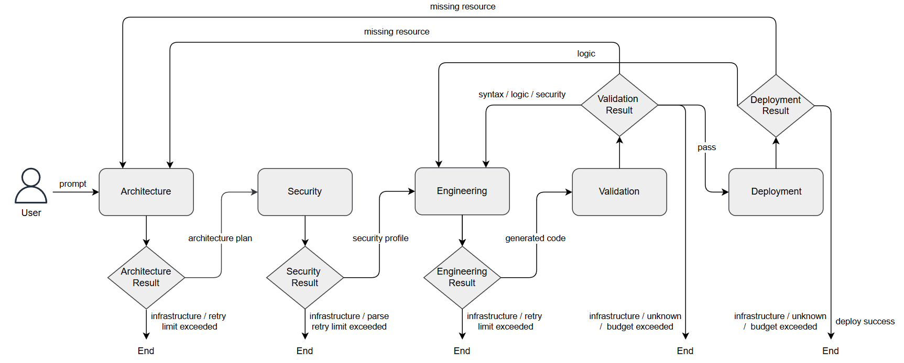
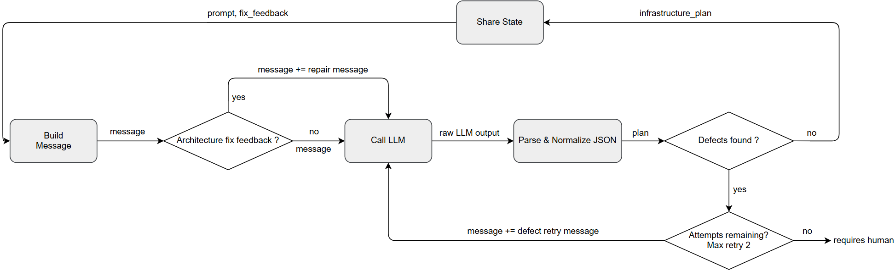
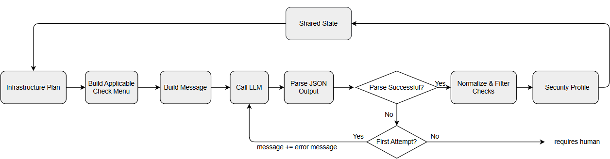
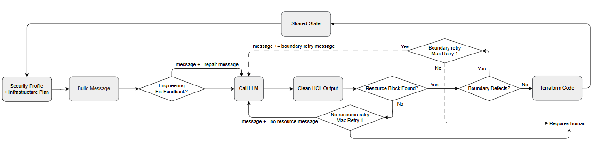
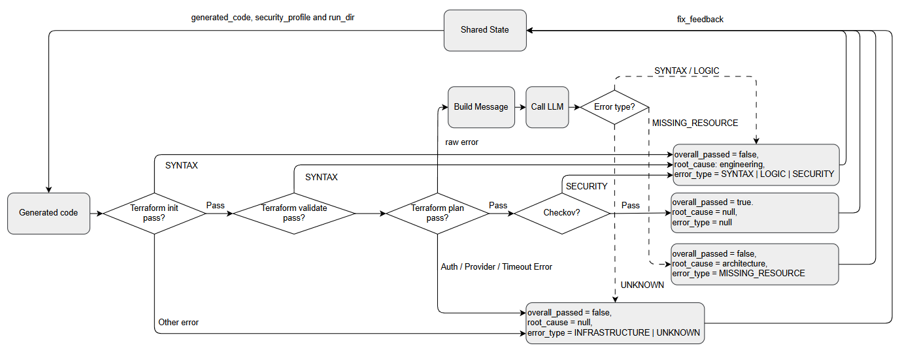
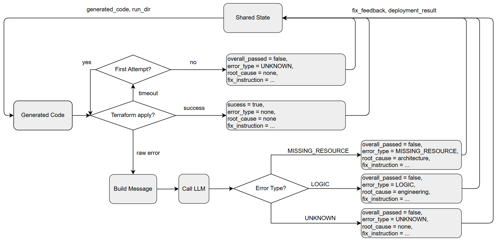

# KHUNG ĐA TÁC TỬ HỖ TRỢ SINH MÃ TERRAFORM CHO HẠ TẦNG AWS CÓ KHẢ NĂNG TRIỂN KHAI VÀ AN TOÀN

**A Multi-Agent Framework for Secure and Deployable AWS Terraform Code Generation**

Đề tài xây dựng một framework đa tác tử dùng LangGraph để sinh mã Terraform cho hạ tầng AWS. Framework không chỉ tạo cấu hình HCL từ yêu cầu ngôn ngữ tự nhiên, mà còn kiểm tra tính hợp lệ, kiểm tra bảo mật bằng Checkov, tự sửa lỗi qua các vòng retry, và có thể triển khai thật lên AWS để đánh giá khả năng deploy của mã sinh ra.

## Mục Lục

- [KHUNG ĐA TÁC TỬ HỖ TRỢ SINH MÃ TERRAFORM CHO HẠ TẦNG AWS CÓ KHẢ NĂNG TRIỂN KHAI VÀ AN TOÀN](#khung-đa-tác-tử-hỗ-trợ-sinh-mã-terraform-cho-hạ-tầng-aws-có-khả-năng-triển-khai-và-an-toàn)
  - [Mục Lục](#mục-lục)
  - [Tổng Quan](#tổng-quan)
  - [Luồng Xử Lý](#luồng-xử-lý)
  - [Vai Trò Các Agent](#vai-trò-các-agent)
    - [Architecture Agent](#architecture-agent)
    - [Security Agent](#security-agent)
    - [Engineering Agent](#engineering-agent)
    - [Validation Agent](#validation-agent)
    - [Deployment Agent](#deployment-agent)
  - [Cấu Trúc Repo](#cấu-trúc-repo)
  - [Cài Đặt](#cài-đặt)
  - [Cấu Hình](#cấu-hình)
  - [Chạy Framework](#chạy-framework)
  - [Đánh Giá](#đánh-giá)
  - [Kết Quả](#kết-quả)
  - [Ghi Chú Metric](#ghi-chú-metric)
  - [Xử Lý Lỗi Thường Gặp](#xử-lý-lỗi-thường-gặp)

## Tổng Quan

Pipeline nhận một yêu cầu hạ tầng bằng ngôn ngữ tự nhiên, sau đó lần lượt:

1. Phân tích yêu cầu thành kế hoạch hạ tầng.
2. Chọn các kiểm tra bảo mật tương ứng với tài nguyên cần tạo.
3. Sinh cấu hình Terraform HCL.
4. Chạy `terraform init`, `terraform validate`, `terraform plan` và Checkov.
5. Deploy bằng `terraform apply`, ghi nhận kết quả, rồi cleanup tài nguyên.

Các lỗi từ validation hoặc deployment được phân loại để route ngược về agent phù hợp. Ví dụ lỗi cú pháp hoặc logic Terraform quay lại Engineering Agent, lỗi thiếu tài nguyên quay lại Architecture Agent, còn lỗi môi trường/quota/AWS không thể tự sửa sẽ dừng ở `requires_human`.

## Luồng Xử Lý



```text
User prompt
  -> Architecture Agent
  -> Security Agent
  -> Engineering Agent
  -> Validation Agent
  -> Deployment Agent
  -> End
```

Routing chính:

```text
Validation SYNTAX / LOGIC / SECURITY -> Engineering Agent
Validation MISSING_RESOURCE          -> Architecture Agent
Validation INFRASTRUCTURE / UNKNOWN  -> requires_human

Deployment LOGIC                     -> Engineering Agent
Deployment MISSING_RESOURCE          -> Architecture Agent
Deployment INFRASTRUCTURE / UNKNOWN  -> requires_human
```

## Vai Trò Các Agent

Mỗi agent đảm nhiệm một phần riêng trong chuỗi sinh mã Terraform. Cách tách vai trò này giúp framework giảm lỗi lan truyền: agent phía sau không chỉ nhận kết quả từ agent trước, mà còn có thể trả feedback có cấu trúc để graph route ngược về đúng nơi cần sửa.

### Architecture Agent



Architecture Agent là bước phân tích yêu cầu ban đầu.

- Đầu vào: prompt mô tả hạ tầng AWS của người dùng.
- Xử lý: trích xuất intent, nhận diện loại tài nguyên cần tạo, xác định quan hệ phụ thuộc giữa các tài nguyên và các ràng buộc quan trọng như region, encryption, public/private access, networking hoặc IAM.
- Đầu ra: `infrastructure_plan`, là bản kế hoạch có cấu trúc để các agent sau sử dụng.
- Vai trò trong retry: nếu Validation hoặc Deployment phát hiện thiếu tài nguyên hoặc thiết kế hạ tầng chưa đủ, graph route lỗi `MISSING_RESOURCE` quay lại Architecture Agent để lập lại kế hoạch.

### Security Agent



Security Agent chuyển kế hoạch hạ tầng thành yêu cầu kiểm tra bảo mật cụ thể.

- Đầu vào: `infrastructure_plan` từ Architecture Agent.
- Xử lý: ánh xạ từng tài nguyên AWS sang các Checkov policy phù hợp, ví dụ S3 cần block public access/encryption/versioning, EC2 cần IMDSv2/security group hợp lý, RDS cần encryption/backup/private access.
- Đầu ra: `security_profile`, gồm danh sách rule bảo mật được chọn cho từng tài nguyên.
- Vai trò trong framework: agent này dùng cách chọn rule theo mức độ liên quan, không ép toàn bộ Checkov rule. Mục tiêu là bảo mật đúng với intent thay vì hardening quá mức làm sai yêu cầu hoặc giảm khả năng deploy.

### Engineering Agent



Engineering Agent sinh mã Terraform từ kế hoạch và profile bảo mật.

- Đầu vào: `infrastructure_plan`, `security_profile` và feedback sửa lỗi nếu có.
- Xử lý: tạo file Terraform HCL hoàn chỉnh, gồm `terraform` block, AWS provider, resource/data block, dependency, IAM policy, networking, tagging và các cấu hình bảo mật đã được chọn.
- Đầu ra: `generated_code`, là cấu hình Terraform có thể ghi ra thư mục tạm để chạy Terraform CLI.
- Vai trò trong retry: khi Validation Agent phát hiện lỗi cú pháp, lỗi logic Terraform, lỗi Checkov hoặc lỗi plan có thể sửa bằng code, graph route về Engineering Agent để sinh bản HCL mới dựa trên feedback.

### Validation Agent



Validation Agent là lớp kiểm tra trước khi triển khai.

- Đầu vào: `generated_code` từ Engineering Agent.
- Xử lý: chạy `terraform init`, `terraform validate`, `terraform plan` và Checkov scan. Kết quả lỗi được chuẩn hóa thành các nhóm như `SYNTAX`, `LOGIC`, `SECURITY`, `MISSING_RESOURCE`, `INFRASTRUCTURE` hoặc `UNKNOWN`.
- Đầu ra: `fix_feedback`, gồm trạng thái pass/fail, loại lỗi, log rút gọn và chỉ dẫn sửa lỗi.
- Vai trò trong routing: nếu validation pass thì graph chuyển sang Deployment Agent. Nếu lỗi do code thì quay lại Engineering Agent; nếu lỗi do thiếu hoặc sai kế hoạch thì quay lại Architecture Agent; nếu lỗi môi trường hoặc vượt retry budget thì dừng ở `requires_human`.

### Deployment Agent



Deployment Agent kiểm tra khả năng triển khai thực tế của mã Terraform.

- Đầu vào: mã Terraform đã pass validation và plan.
- Xử lý: chạy `terraform apply` trên AWS thật, theo dõi tài nguyên được tạo, phân loại lỗi triển khai, sau đó cleanup bằng destroy worker để hạn chế tài nguyên tồn dư.
- Đầu ra: `deployment_result`, gồm trạng thái thành công/thất bại, loại lỗi, tài nguyên tạo được và thông tin phục vụ chấm điểm.
- Vai trò trong đánh giá: đây là điểm khác biệt chính so với các hệ chỉ sinh mã hoặc chỉ validate tĩnh. Framework đo được mã có thực sự deploy được trong môi trường AWS hay không, đồng thời route một số lỗi deploy có thể sửa về Engineering hoặc Architecture.

## Cấu Trúc Repo

```text
.
├── agents/          # 5 node agent: architecture, security, engineering, validation, deployment
├── assets/          # Sơ đồ framework và sơ đồ từng agent
├── bootstrap/       # Dữ liệu hoặc tiện ích bootstrap nếu cần
├── core/            # State, retry control, Terraform helper, parser, scoring helper
├── dataset/         # Bộ prompt đánh giá data-dev.csv và data-test.csv
├── prompts/         # Prompt template cho từng agent
├── results/         # Kết quả benchmark và score đã chạy
├── scripts/         # Script tiện ích
├── baseline.py      # Baseline single-agent/direct generation
├── eval.py          # Runner đánh giá multi-agent
├── graph.py         # LangGraph orchestration
└── score.py         # Tính metric từ output benchmark
```

## Cài Đặt

Yêu cầu:

- Python 3.11+
- Terraform 1.5+
- Checkov
- AWS credentials nếu chạy `plan`/`apply` thật
- API key cho LLM provider

Tạo môi trường Python:

```powershell
python -m venv venv
.\venv\Scripts\Activate.ps1
pip install -r requirements.txt
```

## Cấu Hình

Tạo file `.env` từ `.env.example` và điền khóa cần thiết:

```ini
LLM_PROVIDER=deepseek
DEEPSEEK_API_KEY=your_key_here
DEEPSEEK_MODEL=deepseek-v4-pro

AWS_ACCESS_KEY_ID=your_access_key
AWS_SECRET_ACCESS_KEY=your_secret_key
AWS_DEFAULT_REGION=us-east-1

TF_PLAN_TIMEOUT=300
TF_LOCK_TIMEOUT=60s
TF_INPUT=false
TF_IN_AUTOMATION=true
TF_PLUGIN_CACHE_DIR=.tf_plugin_cache
```

## Chạy Framework

Chạy một prompt đơn:

```powershell
python graph.py "Create an S3 bucket with versioning and server-side encryption enabled."
```

Chạy benchmark có deploy thật:

```powershell
python eval.py --dataset dataset/data-dev.csv --out results/full.json --workers 5
```

Chạy benchmark không deploy:

```powershell
python eval.py --dataset dataset/data-dev.csv --no-deploy --out results/no-deploy.json --workers 5
```

Chạy một case demo để trace luồng agent:

```powershell
python trace.py --csv dataset/demo-trace.csv --case 0 --no-deploy
```

Lệnh trên in walkthrough chi tiết từng bước A1 -> A4: agent đọc gì từ state, ghi gì vào state, route sang node nào và vì sao. Nếu muốn tạo JSON kết quả ngắn để xem `routing_log`, chạy:

```powershell
python eval.py --dataset dataset/demo-trace.csv --no-deploy --out results/demo-trace.json --workers 1 --overwrite
```

File `results/demo-trace.json` sẽ có trạng thái từng agent, `routing_log`, số lần retry, thời gian chạy và mã Terraform sinh ra. Nếu muốn demo cả bước deploy thật, bỏ cờ `--no-deploy` ở hai lệnh trên.

Chạy baseline:

```powershell
python baseline.py --csv dataset/data-dev.csv --retry 0 --out results/b0.json --workers 5
python baseline.py --csv dataset/data-dev.csv --retry 2 --out results/b1.json --workers 5
```

Chấm điểm:

```powershell
python score.py results/full.json --csv dataset/data-dev.csv --checkov --llm-judge --out results/score.json
```

## Đánh Giá

Các file kết quả hiện có nằm trong `results/`:

| Nhóm | File score | Raw output |
|---|---|---|
| Baseline B0 direct, không retry | `results/b0_score.json` | raw file được ghi trong score |
| Baseline B1 direct + repair | `results/b1_score.json` | raw file được ghi trong score |
| Framework không deploy | `results/nodeploy_score.json` | `results/no-deploy0.json`, `results/no-deploy2.json`, `results/no-deploy3.json` |
| Framework full deploy | `results/score.json` | `results/full1.json`, `results/full2.json`, `results/full3.json` |

## Kết Quả

### So Sánh Không Deploy

Bảng này so sánh baseline và framework ở chế độ không deploy thật. Các cấu hình đều được đánh giá trên 140 prompt/run, tập trung vào khả năng sinh mã hợp lệ, đúng intent, bám tài nguyên và đạt kiểm tra bảo mật trước khi `terraform apply`.

| Cấu hình | Runs | Prompt/run | Plan valid | Deploy success | LLM judge | Security micro | Resource F1 | Time TB | Retry TB |
|---|---:|---:|---:|---:|---:|---:|---:|---:|---:|
| Baseline B0 direct | 1 | 140 | 82.14% | N/A | 87.59% | 57.88% | 81.57% | 55.4s | 0.00 |
| Baseline B1 direct + repair | 1 | 140 | 93.57% | N/A | 86.96% | 60.89% | 82.87% | 80.3s | 0.31 |
| Framework no-deploy | 1 | 140 | 95.71% | N/A | 85.00% | 61.61% | 86.26% | 94.0s | 0.58 |

### Framework Full Deploy

Phần này trình bày riêng kết quả framework khi chạy đầy đủ validation và deploy thật lên AWS. Framework được chạy 3 lần độc lập trên cùng bộ 140 prompt để đo độ ổn định của kết quả. Metric `deploy_success` phụ thuộc thêm vào quota, naming conflict, region và trạng thái môi trường AWS tại thời điểm chạy.

Kết quả của 3 lần chạy full deploy:

| Lần chạy | File | Prompt | Plan valid | Deploy success | LLM judge | Security micro | Resource F1 | Time TB | Retry TB |
|---|---|---:|---:|---:|---:|---:|---:|---:|---:|
| Run 1 | `full1.json` | 140 | 89.29% | 80.00% | 80.00% | 60.31% | 82.02% | 172.8s | 1.36 |
| Run 2 | `full2.json` | 140 | 91.43% | 82.14% | 76.98% | 62.42% | 81.82% | 159.4s | 1.33 |
| Run 3 | `full3.json` | 140 | 93.57% | 83.57% | 76.98% | 60.24% | 82.17% | 190.1s | 1.47 |

Tổng hợp 3 lần chạy:

| Cấu hình | Runs | Prompt/run | Plan valid TB | Deploy success | LLM judge TB | Security micro TB | Resource F1 TB | Time TB | Retry TB |
|---|---:|---:|---:|---:|---:|---:|---:|---:|---:|
| Framework full deploy | 3 | 140 | 91.43% | 81.90% | 77.99% | 60.99% | 82.00% | 174.1s | 1.39 |

Với 3 run full deploy, kết quả tổng hợp trong `results/score.json`:

| Metric | Giá trị |
|---|---:|
| Deploy success bootstrap mean | 81.90% |
| 95% CI của deploy success | 76.67% - 86.90% |
| pass@1 | 81.90% |
| pass@2 | 90.95% |
| pass@3 | 94.29% |
| resolved@<=1 across runs | 40.71% |

## Ghi Chú Metric

- `plan_valid`: tỷ lệ cấu hình pass `terraform validate` và `terraform plan`.
- `deploy_success`: tỷ lệ `terraform apply` thành công trên AWS thật, phụ thuộc quota, naming conflict, region và trạng thái môi trường.
- `security_micro`: tỷ lệ pass khi quét Checkov trên toàn bộ check thu được. Đây là metric mô tả posture, không phải mục tiêu tối đa hóa tuyệt đối.
- `resource_f1`: độ khớp giữa loại tài nguyên cần tạo và loại tài nguyên framework tạo ra.
- `resolved@<=k`: tỷ lệ prompt được framework tự xử lý trong tối đa `k` vòng retry nội bộ.
- `pass@k`: ước lượng xác suất có ít nhất một run pass khi lấy `k` run độc lập.

## Xử Lý Lỗi Thường Gặp

- `terraform not found`: cài Terraform và thêm vào `PATH`.
- `checkov not found`: chạy `pip install -r requirements.txt`.
- `AWS credentials not found`: kiểm tra `AWS_ACCESS_KEY_ID`, `AWS_SECRET_ACCESS_KEY`, `AWS_DEFAULT_REGION`.
- `terraform init` chậm hoặc lỗi provider: dùng `TF_PLUGIN_CACHE_DIR=.tf_plugin_cache` và có thể chạy warm cache trước khi benchmark.
- Lỗi quota/naming khi deploy: đây là lỗi môi trường, Deployment Agent sẽ route sang `requires_human` nếu không thể tự sửa an toàn.
- LLM timeout hoặc output bị cắt: tăng `LLM_TIMEOUT` và các biến `LLM_MAX_TOKENS_*` trong `.env`.
